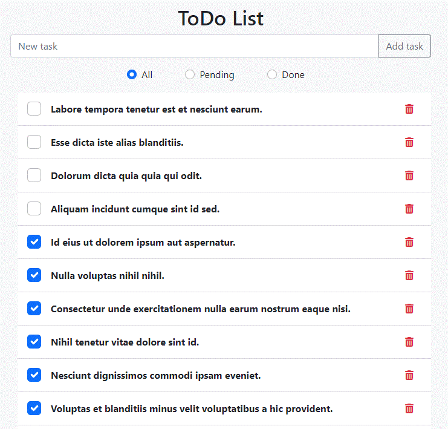

## Projeto - ToDo List com Livewire e Bootstrap 

Projeto criado com base na vídeo aula do @pinguimdolaravel no YouTube.

Seguem alguns links para referência:

- [Vídeo aula que inspirou o projeto](https://www.youtube.com/watch?v=Z918G-JSKjY).
- [Github Pinguim do Laravel](https://github.com/pinguimdolaravel).

